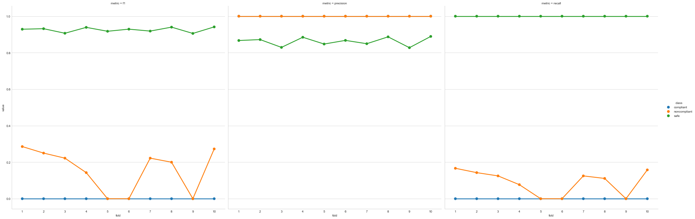

## Introduction

### Part I: Decision Tree

We implemented a decision tree from scratch in pure python, as well as using scikit learn.

Our own implementation had a precision that fluctuated within the range from 80-90%.

Here is each metric for each class.

The Scikit Learn implementation consistently obtained f1 scores around 99%.

## Part II: K-Means Clustering

We determined the optimal k-value using an elbow implementation.

Here are the clusters over 10 folds:

## Part III: Evaluation

Based on the results of our implementation of the elbow method, we tried a range of k values from 4 to 8 - the graph generated by the elbow method was quite smooth and we could make a case for any of these values being the correct elbow.  Of these, 4 broke up the data into the most natural-looking sections, but 8 had the best performance on the test data by about 1.5%.  We chose to stick with 4, since the performance difference was fairly small and it illustrated the layout of the data much more cleanly.

The clustering process, much more so than the decision trees, identified the areas of moderate speed and distance that were by far the most likely to be either "compliant" or "noncompliant" rather than "safe". Thanks to the small number of information classes, the decision tree usually had to make the "best guess" of safe when it reached a leaf node, only once identifying a definitive (0-entropy) non-safe leaf node.

This may be partially attributable to the binning we chose, but the current binning performed the best out of several options.

Where decision trees faltered, however, only performing slightly better than the baseline majority class, k-means clustering shined. Based on the results of this process, we can roughly split the data into three or four sections: low-distance, low-speed instances, which were uniformly classified as safe; high-distance, low-speed instances, which were also largely safe; low-distance, medium-speed instances, which were split between compliancy and non-compliancy; and a diffuse cloud of high-distance, medium-high speed instances that were difficult to classify but mostly safe.

(The location feature was almost entirely unimportant in determining trends in the data, and the speed feature was by far the most relevant)
