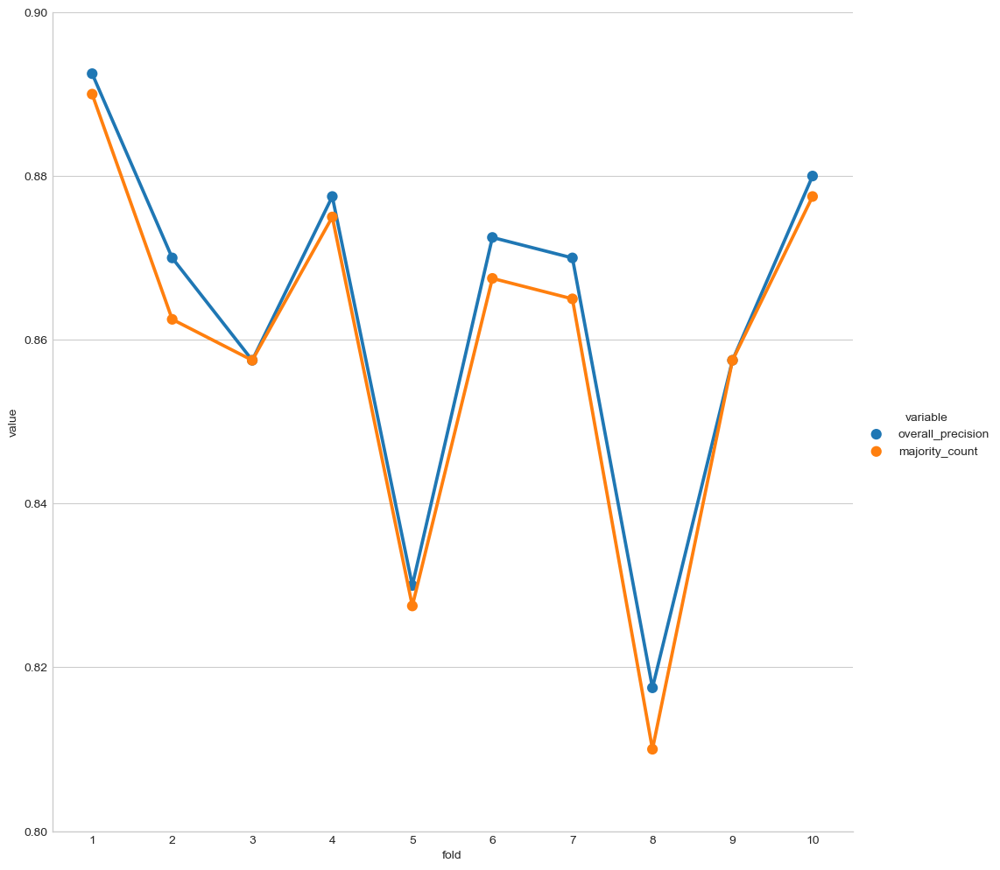
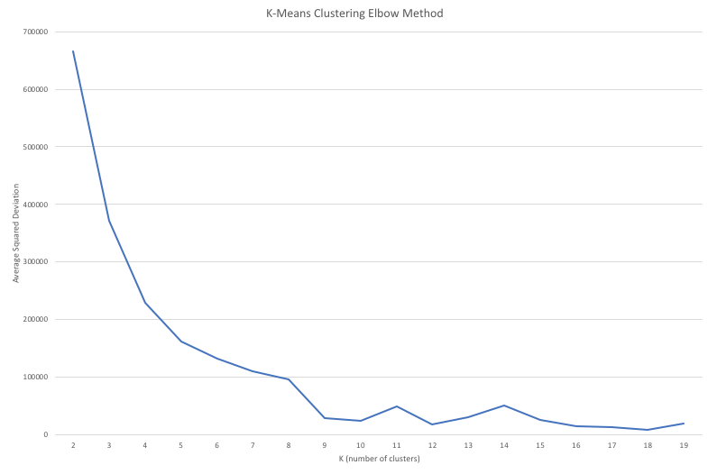

# HW #3: HeatMiser Meet OSHA

```
Galen Berger-Fletcher, Dustin Michels
21 Feb 2017
CS.321 AI
```

## Introduction

## Part I: Decision Tree

We implemented a decision tree from scratch in pure python, as well as using scikit learn.

Our own implementation
 had that fluctuated within the range from 80-90%.

The Scikit Learn implementation consistently obtained f1 scores around 99%.


## Part II: K-Means Clustering

We determined the optimal k-value using an elbow implementation.



Here are the clusters over 10 folds:


## Part III: Evaluation

> Based on the results of Part 1 and Part 2, provide an analysis of the compliance picture of the HeatMiser robots. Does a clear picture emerge as to what is going on? What about outliers? Were there patterns in the misclassifications? Is one approach better than another for getting a handle on the data?  What changes can be considered in rerunning the algorithms?

> In addition to the plots and visualizations described above, rely on at least two additional visualizations (one for supervised, one for unsupervised (best decision tree, tightest cluster, confusion matrices, perhaps) to make your arguments. Comment also on the generalizability of your approach to evaluating the remaining 1000 Heat Misers not represented in the data.
