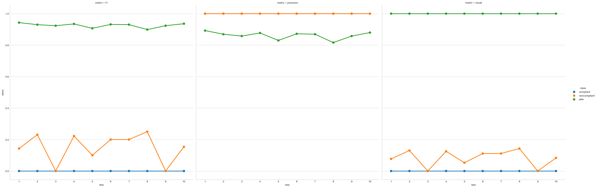

All the figures in this report can be found in the `images/` folder, for closer viewing. All except for the elbow graph were programmatically generated in Python.

## Decision trees

We implemented a decision tree from scratch in pure python, as well as using scikit learn. Our own implementation had an overall precision that fluctuated within the range from 80-90%, just slightly above the baseline.

Our algorithm was by far best at predicting the "safe" class, by every metric, and it had better precision than it did $f_1$ or recall.

The Scikit Learn implementation consistently obtained f1 scores around 99%. Like our classifier, it at was best at predicting "safe" and worst at predicting "compliant".

As explained in [a section of documentation on algorithms](http://scikit-learn.org/stable/modules/tree.html#tree-algorithms-id3-c4-5-c5-0-and-cart), they use a decision tree algorithm called "CART", which is a successor to the ID3 algorithm, which appears more similar to what we implemented by hand. Their algorithm is more sophisticated than ours, and differs in interesting ways.

For one thing, it does not "bin" the numerical inputs into categories ahead of time. Rather, at each node it tries every "cutoff point" for every feature, and chooses the single value that provides the greatest information gain. While in general, decision trees can handle categorical data of various types, their implementation requires numerical values, so our string categories had to be encoded using a "OneHot" encoding. Evidently, OneHot is preferable to simply mapping strings into some number, so the tree does not treat them as continuous. Additionally, their algorithm does not appear to discard feature classes once they are used at one point along a branch, but allows them to re-used again to further refine the results.

To both our implementation and the scikit learn implementation, the location feature was almost entirely unimportant in determining trends in the data, and the speed feature was by far the most relevant

## K-Means Clustering

We determined the optimal k-value using an elbow implementation to be 4 clusters.

Here are the four clusters formed from the training data, for each of 10 cross-validation folds:

Based on the results of our implementation of the elbow method, we tried a range of k values from 4 to 8 - the graph generated by the elbow method was quite smooth and we could make a case for any of these values being the correct elbow.  Of these, 4 broke up the data into the most natural-looking sections, but 8 had the best performance on the test data by about 1.5%.  We chose to stick with 4, since the performance difference was fairly small and it illustrated the layout of the data much more cleanly.

## Further Evaluation

The clustering process, much more so than the decision trees, identified the areas of moderate speed and distance that were by far the most likely to be either "compliant" or "noncompliant" rather than "safe". Thanks to the small number of information classes, the decision tree usually had to make the "best guess" of safe when it reached a leaf node, only once identifying a definitive (0-entropy) non-safe leaf node.

This may be partially attributable to the binning we chose, but the current binning performed the best out of several options.

Where decision trees faltered, however, only performing slightly better than the baseline majority class, k-means clustering shined. Based on the results of this process, we can roughly split the data into three or four sections: low-distance, low-speed instances, which were uniformly classified as safe; high-distance, low-speed instances, which were also largely safe; low-distance, medium-speed instances, which were split between compliancy and non-compliancy; and a diffuse cloud of high-distance, medium-high speed instances that were difficult to classify but mostly safe.

After performing 10-fold cross-validation on our k-means clustering algorithm and finding an average of ~93% accuracy when classifying instances of the test data across all folds, we can be reasonably confident that this approach will perform well when extended to the rest of the HeatMiser data."
